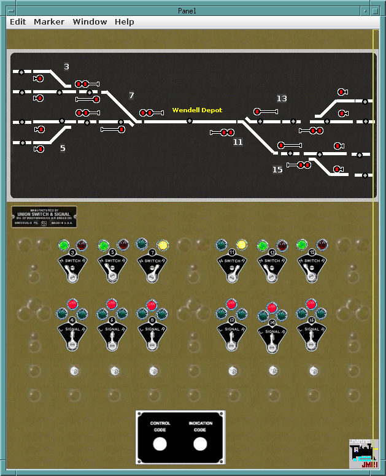

# PanelPro

This directory contains the JMRI PanelPro CTC Panel.  In the 
[Software](../Software) directory is the jython code (JMRI-CTC-Occupancy.py)
that implements the occupancy detection for this panel.

- Screenshot of Panel: 

- WendellDepot-JMRI-withPanel.xml This is the JMRI PanelPro CTC Panel file, 
along with the JMRI Device tables that go with it.

