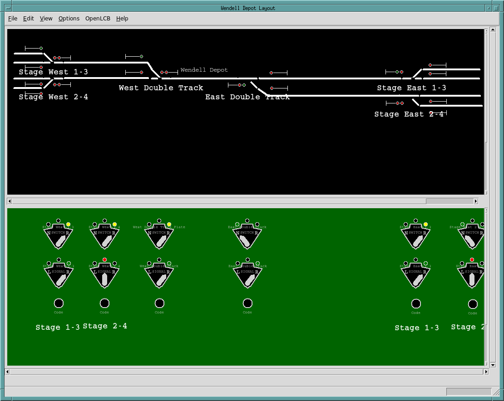

# Software

This directory contains the various pieces of software involved in the layout:

- MRR System Dispatcher panel: WendellDepot.tcl

  Screen shot: 

- JMRI Jython script to implement occupancy detection for the PanelPro CTC
  Panel: JMRI-CTC-Occupancy.py
  
- Helper script to generate initializer data: GenerateRouteInitializer.tcl

- Helper scripts to convert Layout DB to program data: 
  LayoutControlDB2ConfigureCXX.tcl (C++) and 
  LayoutControlDB2TclArrays.tcl (Tcl)
  
- Source code for OpenMRN program to auto run trains: config.mk, main.cxx, 
  Makefile, OpticalLocationSensor.cxx, OpticalLocationSensor.hxx, 
  PointSensor.cxx, PointSensor.hxx, RunATrain.cxx, RunATrain.hxx, Sensor.cxx,
  Sensor.hxx, Signal.cxx, Signal.hxx, Turnout.cxx, Turnout.hxx, 
  WendellDepotWebserver.cxx, WendellDepotWebserver.hxx

- Helper library for the OpenMRN program: [httpd](httpd)

- Static HTML for the OpenMRN program's web interface: [static](static)

- Target build directory for the OpenMRN program" [targets][(targets)
